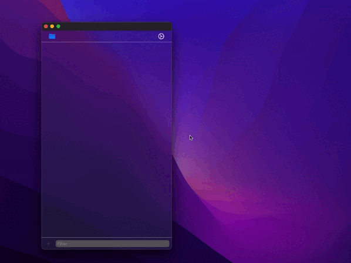

## XCDoTo - Xcode simple to-do list
**It was first conceived to be deeply and conveniently integrated with Xcode**

**But unfortunately Xcode Source Extension doesn't provide great options for developers, though we can do things like text manipulation. We cannot integrate our UI inside Xcode - disappointing**

## Keypoints were:
- Make tasks list portable, it was decided to use .yaml files with really simple structure and minimum meta info.
- Support multiple projects at once. But as there is no really a good option to discover actual path to the file(___where tasks stored___) - was decided to leave command implementation for the future...
- Use SwiftUI
- Preserve Xcode style

## Usage

